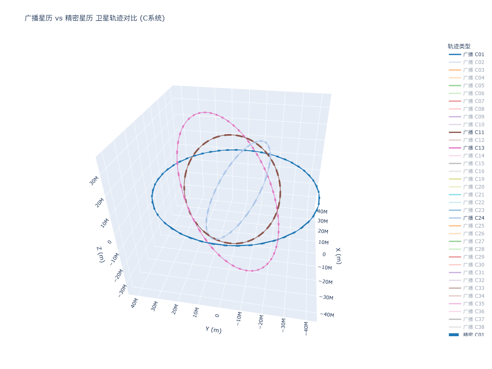
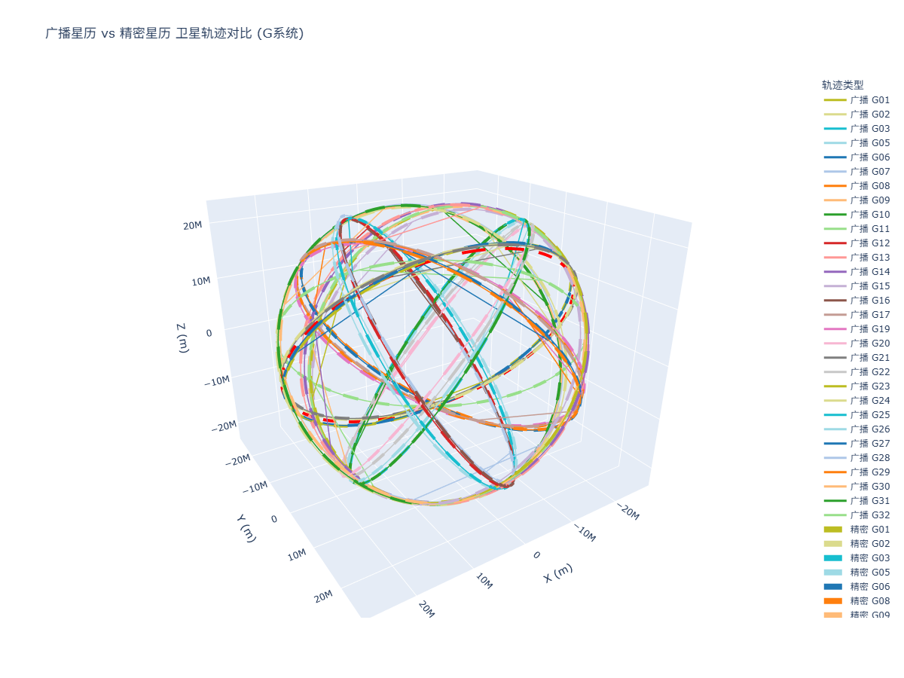
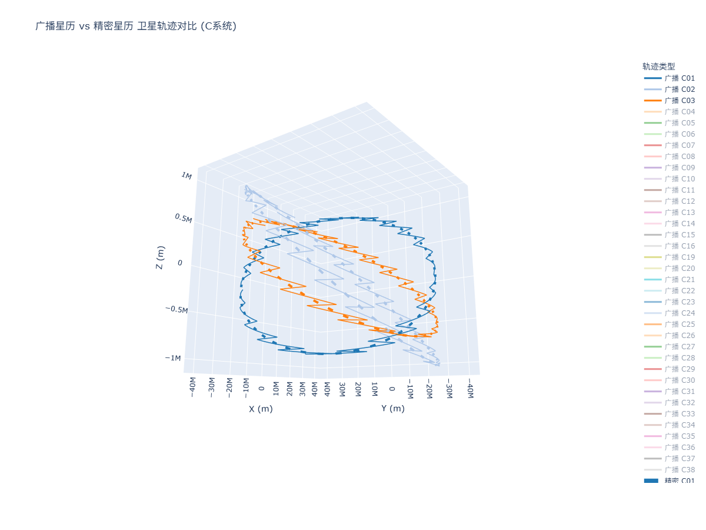
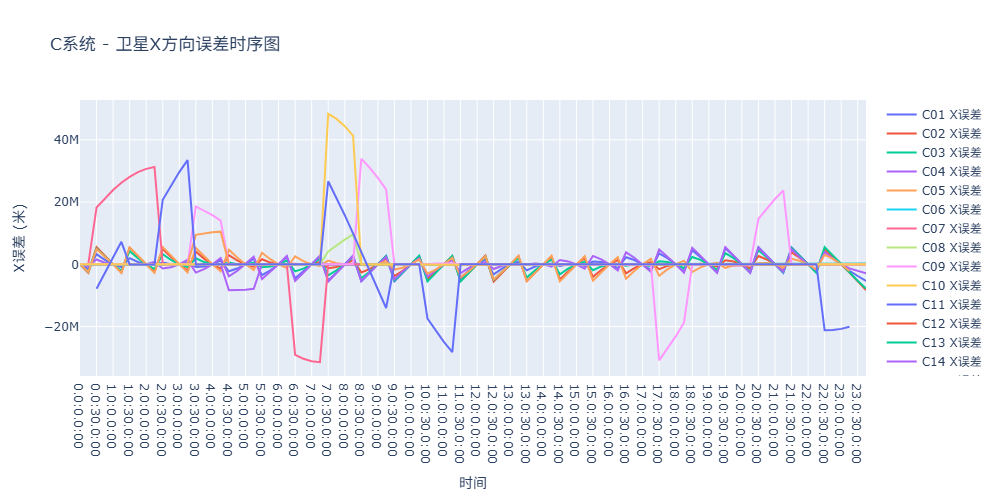
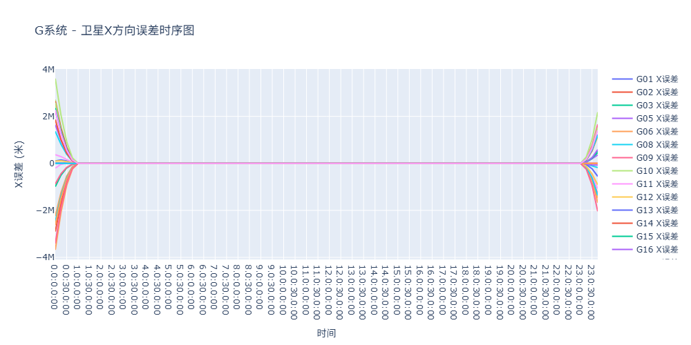

## RINEX广播星历解算卫星轨道&精密星历验证
### RINEX广播星历解算

#### [DATA_RINEX303.cpp](src/DATA_RINEX303.cpp)
由于北斗卫星系统中C01~C05属于**GEO卫星**，轨道计算略有不同，故加以区分
可以使用[POS_NAV_Project.exe](cmake-build-debug/POS_NAV_Project.exe)直接运行
```c++
void BDS_Positioning(Rinex_Navigation_Message_Data &data, std::vector<Navi_Data_Body>::iterator &it, Rinex_Navigation_Message_Result &result)
{
    if(it->sPRN[1]=='0'&&it->sPRN[2]<'6'&&it->sPRN[2]>'0')
        GEO_Flag=1;
    ...
}
```
#### [RINEX_SP3.py](src/RINEX_SP3.py)
绘制轨道图像，轨道图像保存为html文件 [GPS轨迹](HTML/GPS轨迹.html) [BDS轨迹](HTML/BDS轨迹.html)

**实线为广播星历解算结果，虚线为精密星历插值结果**



#### 问题
广播星历解算的北斗卫星系统中GEO卫星轨道存在问题，还没有解决。



#### 误差评估




## RINEX观测值数据读取以及GF、MW组合构造

运行[POS_NAV_Project.exe](cmake-build-debug/POS_NAV_Project.exe)或是[main.cpp](src/main.cpp)

[GF_MW_Plot.py](src/GF_MW_Plot.py)为绘图分析
需要将main.cpp输出文件[RINEX_Obs_GF&WM.txt](cmake-build-debug/RINEX_Obs_GF%26WM.txt)、[RINEX_Obs_GF&WM_Dif.txt](cmake-build-debug/RINEX_Obs_GF%26WM_Dif.txt)复制到同一父文件夹下
[interactive_gnss_plot.html](HTML/interactive_gnss_plot.html) [interactive_gnss_plot_dif.html](HTML/interactive_gnss_plot_dif.html)分别是GF、MW观测值时间序列以及历元差分时间序列
历元差分以该卫星每个连续时间序列段的第一个历元为参考历元


## Novatel
### Novatel 数据读取